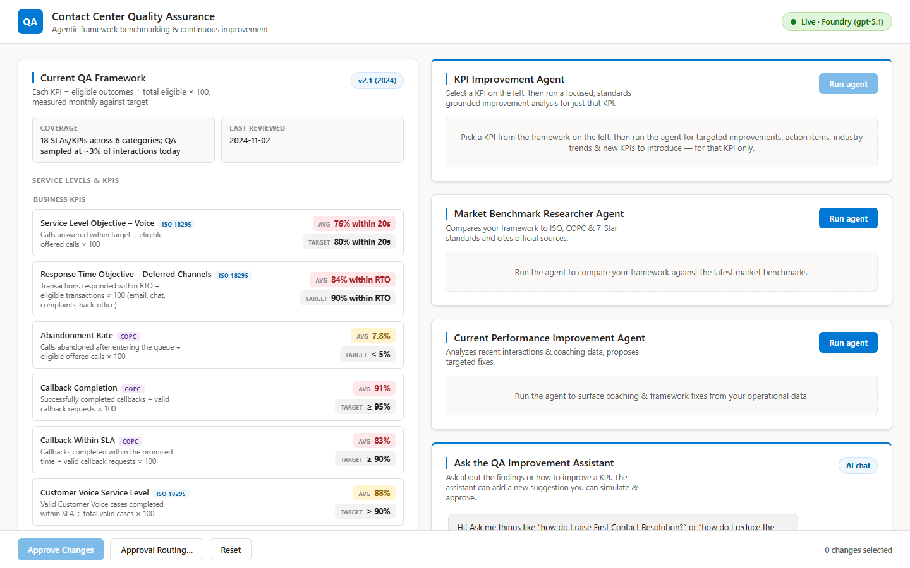
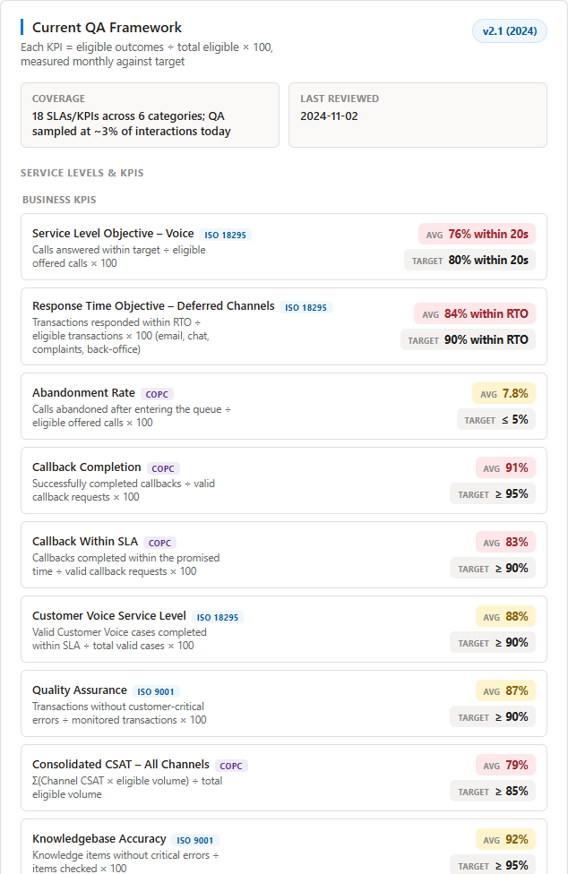
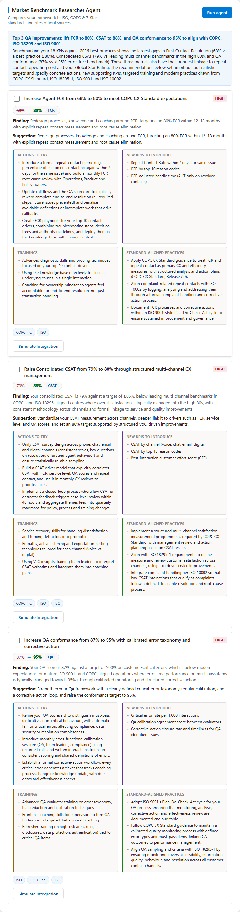
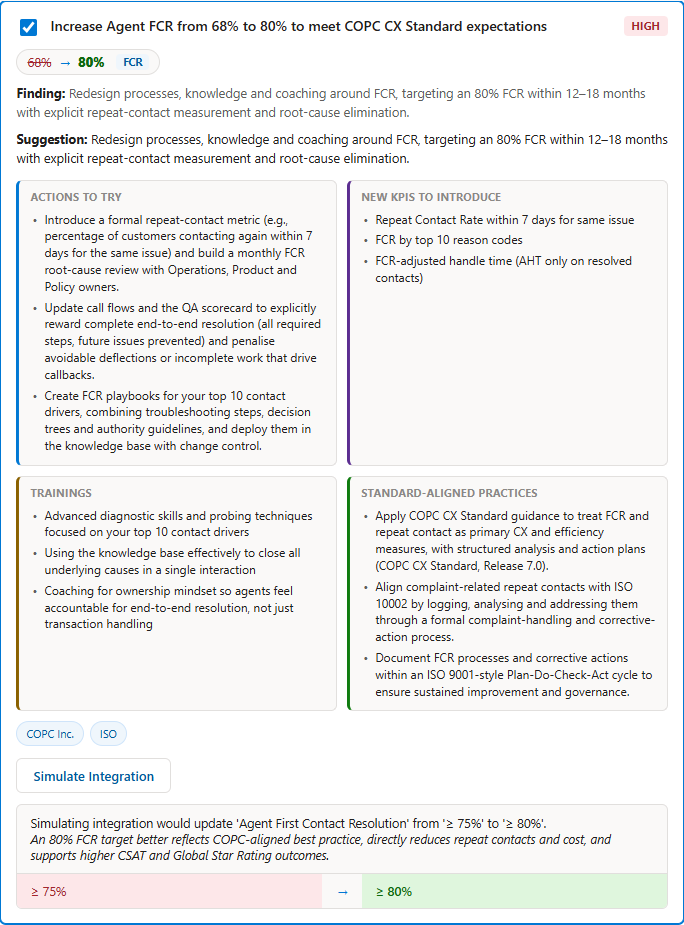
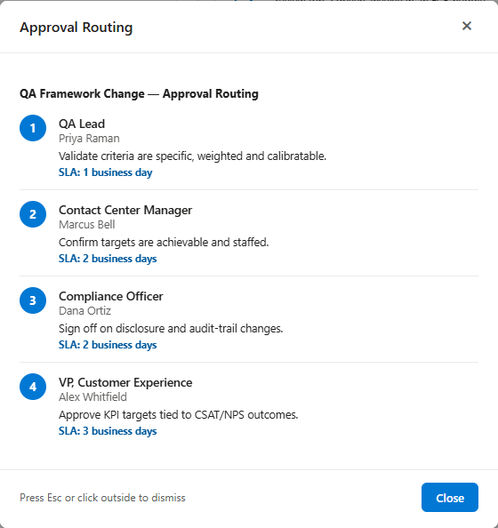

An AI-assisted **contact center Quality Assurance (QA)** workflow. Agentic
assistants keep a QA program's SLAs/KPIs aligned to recognised quality standards
(**ISO 18295**, **ISO 9001**, **COPC CX Standard**, the **UAE Global 7‑Star
Rating**) and recommend concrete, **sourced** improvements that cite the exact
standard pages.

Built with **Microsoft Agent Framework for Python** and the **Microsoft Foundry
chat client**. A dependency-free HTML/CSS/JS front end is served by FastAPI (no
build step).



## Features

- **KPI Improvement agent** — select any KPI on the left and get a focused,
  standards-grounded plan (actions, new KPIs, trainings, industry practices) for
  that KPI only.
- **Market Benchmark Researcher** — compares your framework to ISO / COPC /
  7‑Star standards and cites the **exact standard pages**.
- **Performance Improvement agent** — turns recent operational data into
  prioritised, KPI-specific fixes.
- **QA Improvement Assistant (chat)** — ask how to move a metric; it can drop a
  new, simulatable suggestion onto the board.
- **Live streaming** — every agent run streams its tool steps and drafting
  progress in real time (Server-Sent Events).
- **Governance loop** — Simulate Integration → Approve Changes → Approval
  Routing (QA Lead → Manager → Compliance → VP CX).
- **Two run modes** — a rich deterministic **simulation** out of the box, or
  **live** agents when a Foundry project is configured. Same data shape either
  way; a badge shows the active mode.

## Quick start (local)

```powershell
python -m venv .venv
.\.venv\Scripts\Activate.ps1
pip install -r requirements.txt
python -m uvicorn backend.main:app --reload --port 8000
```

Open <http://localhost:8000>. Without a Foundry project it runs in **simulation**
mode — no cloud resources required.

### Live mode (Microsoft Foundry)

1. Copy `.env.example` to `.env` and set `FOUNDRY_PROJECT_ENDPOINT`,
   `FOUNDRY_MODEL`, etc.
2. `az login` (with `AZURE_CREDENTIAL=cli`), or use a managed identity with
   `AZURE_CREDENTIAL=default`.
3. Restart the app; the badge switches to **Live · Foundry**.

The identity needs **Azure AI Developer** (and **Cognitive Services OpenAI
User**) on the Foundry resource.

## Deploy to Azure Container Apps

A one-shot script builds the image from source (ACR cloud build — no local
Docker), deploys the app, gives it a managed identity, and grants that identity
access to your Foundry resource:

The deployment script requires PowerShell 7.3 or later and Azure CLI.

```powershell
az login
./deploy/azure-containerapp.ps1 `
  -FoundryAccount '<foundry-account-name>' `
  -FoundryResourceGroup '<foundry-resource-group>' `
  -FoundryEndpoint `
    'https://<resource>.services.ai.azure.com/api/projects/<project>' `
  -FoundryModel 'gpt-4o'
```

The three Foundry resource parameters are required. Resource group, location,
app name, environment name, and model have portable defaults that you can
override.

It sets these container environment variables:

| Variable | Value |
| --- | --- |
| `FOUNDRY_PROJECT_ENDPOINT` | your Foundry project endpoint |
| `FOUNDRY_MODEL` | e.g. `gpt-5.1` |
| `AZURE_CREDENTIAL` | `default` (uses the container's managed identity) |
| `ENABLE_WEB_SEARCH` | `true` |
| `LOG_LEVEL` | `INFO` |
| `ENABLE_AGENT_TRACES` | `false` |

The container ([`Dockerfile`](Dockerfile)) listens on port 8000.

### Required Azure permissions

`az containerapp up --source` creates a resource group, an Azure Container
Registry (for the cloud build), a Container Apps environment, and the app, then
adds two role assignments on your Foundry resource. The signed-in identity needs:

- **Contributor** on the target subscription or resource group — to create the
  resource group, registry, environment, and container app, and
- **User Access Administrator** or **Owner** on the Foundry resource — to grant
  the app's managed identity **Azure AI Developer** and **Cognitive Services
  OpenAI User**.

A Foundry-scoped account without Contributor cannot run this end to end:
resource-group creation, ACR build (`listBuildSourceUploadUrl`), and Container
Apps creation (`Microsoft.App/containerApps/write`) each return
`AuthorizationFailed`. Have a subscription Contributor run the script, or pass
`-ResourceGroup` / `-FoundryAccount` / `-FoundryResourceGroup` /
`-FoundryEndpoint` / `-FoundryModel` to target resources you already own.

## API

| Method & path | Purpose |
| --- | --- |
| `GET  /api/status` | Live vs. simulation mode + config |
| `GET  /api/framework` | Current (working) QA framework |
| `POST /api/research/market-benchmark[/stream]` | Run the researcher agent |
| `POST /api/research/performance[/stream]` | Run the performance agent |
| `POST /api/research/kpi[/stream]` | Run the focused per-KPI agent |
| `POST /api/chat` | QA Improvement Assistant |
| `POST /api/integrate` | Preview a finding's change (diff) |
| `POST /api/approve` | Apply approved changes + return routing |
| `GET  /api/approval-route` | Governance routing chain |
| `POST /api/reset` | Restore the original framework |

The `/stream` endpoints return Server-Sent Events (tool / reasoning / output /
done) so the UI shows progress live.

## Project layout

```text
backend/      config, models, mock_data, tools, agents, observability, main (FastAPI)
frontend/     index.html, styles.css, app.js
deploy/       azure-containerapp.ps1   (Azure Container Apps deployment)
screenshots/  UI screenshots used in this README
Dockerfile    container image
requirements.txt / .env.example
```

## Screenshots

| Framework and standards | Live findings with citations |
|-------------------------|-----------------------------|
|  |  |

| Simulated integration | Approval routing |
|-----------------------|------------------|
|  |  |

## Notes & disclaimers

- All operational numbers, teams, owners, and targets are **mock data** for
  demonstration. Replace `backend/mock_data.py` and the `backend/tools.py`
  functions with real data sources to productionise.
- Standard citations link to the official standard pages; the standards
  themselves are the authoritative reference.
- The POC has no application-level authentication and uses permissive CORS for
  demonstration. Add authentication, authorization, rate limiting, and a
  restrictive CORS policy before an internet-facing production deployment.
- This POC is illustrative and is not a substitute for professional QA program
  design or compliance review.
